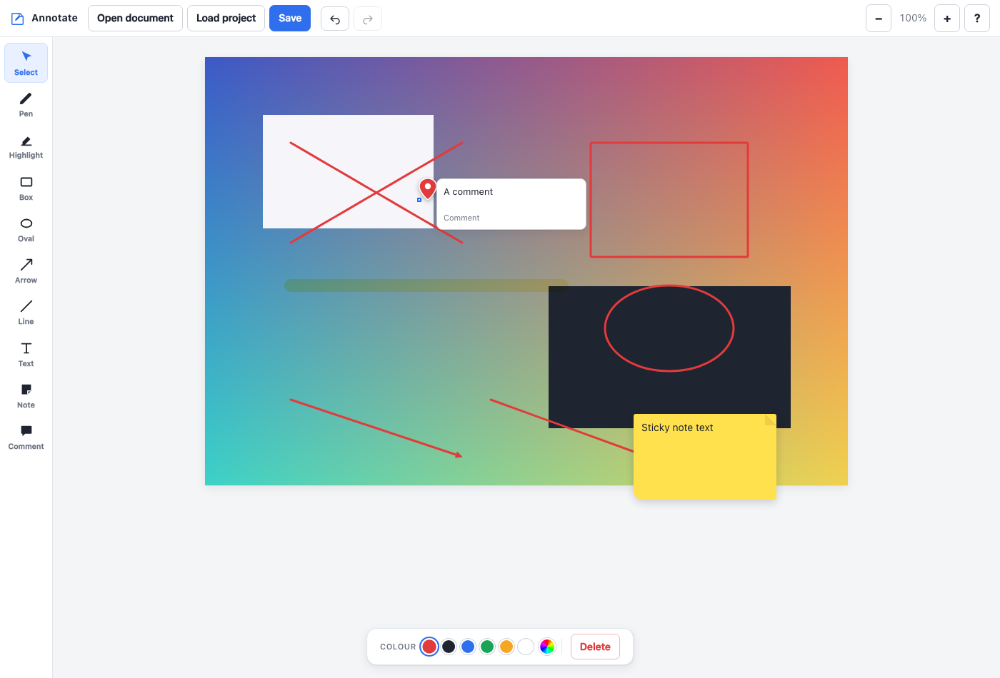
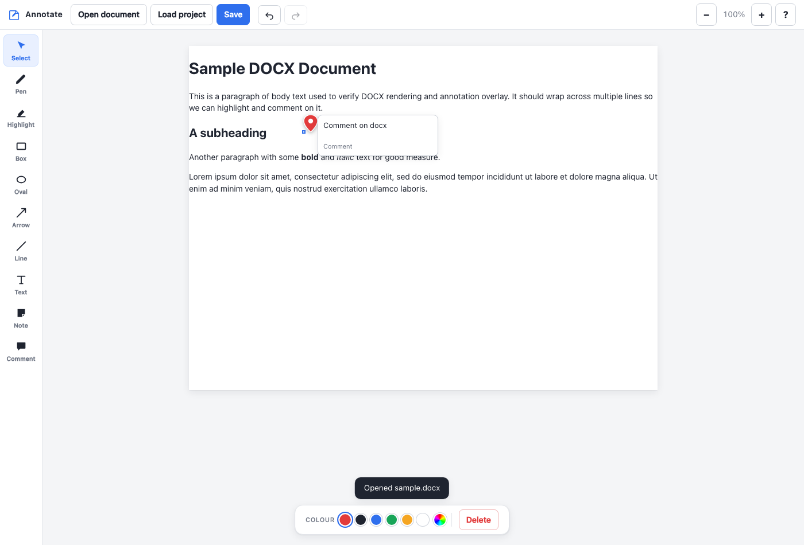
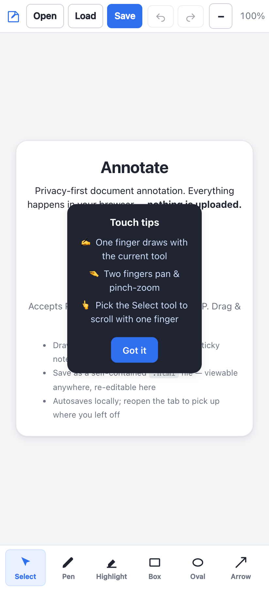

# Annotate

**Privacy-first, fully-local document annotation in your browser.**
Open PDFs, Word documents and images; draw, highlight, add text, sticky notes and comments; then save everything as a single self-contained HTML file. Documents are never uploaded: there is no account, analytics, telemetry, advertising, or document-processing server.



---

## Why

Most "online" annotation tools send documents to a remote service. Annotate doesn't. The application is static HTML, CSS and JavaScript, and files are read, rendered, annotated and saved in your browser. A hosted copy downloads its own application assets; importing a document makes no outbound request.

It's a single folder of plain files with **no build step**, which makes it trivial to audit, fork, self-host, or just double-click to open.

## Features

- **Open** PDF, DOCX, and raster images (PNG, JPG, GIF, WebP, BMP)
- **Draw tools** — freehand pen, rectangle, ellipse, arrow, straight line (hold <kbd>Shift</kbd> to constrain)
- **Highlighter** with 6 colours and adjustable thickness (true multiply blend over text)
- **Text boxes** with font family, size, colour, bold and italic
- **Sticky notes** — resizable, in any colour
- **Margin comments** — numbered document anchors with readable cards in the page margin
- **Colour controls** — 6 quick swatches plus a full custom colour picker
- **Select / move / resize / delete** any annotation
- **Undo / redo** with full history
- **Zoom** in and out
- **Save** as a **self-contained `.html`** file — viewable in *any* browser, *and* re-editable in Annotate
- **Print / PDF** through the browser for a flattened, shareable copy without editor controls
- **PNG export** of the current PDF/image page, flattened locally with its annotations (use Print / PDF for DOCX)
- **Page navigation** for multi-page documents
- **Page thumbnails** with reorder, safe pre-annotation rotation, and guarded deletion
- **Annotation sidebar** to review marks, notes and comments and jump back to their page
- **Autosave** to local browser storage — reopen the tab and pick up where you left off
- **Named local projects** with approximate storage use and explicit deletion
- **Drag & drop** files anywhere onto the window
- **Keyboard shortcuts** for every tool (press <kbd>?</kbd> in-app)
- **Touch & mobile friendly** — auto-detected, with a bottom tool bar and natural gestures (see below)



## Touch & mobile

Annotate detects touch devices automatically and switches to a thumb-friendly layout (a scrollable tool bar along the bottom, larger targets, compact top bar). Gestures follow the convention drawing apps use:

| Gesture | Does |
|---|---|
| **One finger** | Uses the current tool — draw, highlight, drag an annotation… |
| **Two fingers** | Pan **and** pinch-zoom, from any tool. Starting a two-finger gesture cancels an accidental stroke the first finger began. |
| **One finger in Select mode** | Scrolls/pans the page |



On desktop, the same empty-canvas drag works as a quick grab-to-pan, and the mouse wheel scrolls as usual.

## Try it

The public tool is hosted at **[annotate.readcloser.com](https://annotate.readcloser.com)**.

### Hosted / self-hosted (recommended)

Serve the folder with any static web server and open it:

```bash
# Python (built in on macOS/Linux)
python3 -m http.server 8777
# then open http://127.0.0.1:8777
```

Or deploy the staged static folder to GitHub Pages, Netlify, Cloudflare Pages, an S3 bucket — anywhere that serves static files. There is no application build. Run `sh scripts/stage-site.sh` when the host expects an output directory; `_site/` includes an optional `_headers` policy supported by hosts such as Cloudflare Pages and Netlify.

For named projects and autosave, use a dedicated origin (for example a custom domain or
an isolated `pages.dev` site). Annotate intentionally disables persistent document storage
on shared `*.github.io` project origins; editable HTML export continues to work there.

### Just open the file

You can double-click `index.html` for basic local use, but browsers restrict ES modules and workers on `file://`. Use the static-server method for reliable PDF support across browsers.

## How the save format works

When you click **Save**, Annotate writes one `.html` file that contains two things:

1. A fully-rendered, static copy of your document and annotations — so anyone can open the file in any browser and *see* your work, with no dependencies.
2. An embedded JSON snapshot of the project (inside a `<script type="application/json">` tag) — so when you open that same file with **Load project**, Annotate rehydrates it into a fully editable session.

One file, portable, viewable, and re-editable. No sidecar files, no lock-in.

> DOCX is rendered to clean, styled HTML (via [mammoth](https://github.com/mwilliamson/mammoth.js)) and annotated on an overlay. PDFs and images are rasterised per page (via [pdf.js](https://github.com/mozilla/pdf.js)) and annotated on an overlay. This keeps annotation behaviour consistent across every file type.

## Keyboard shortcuts

| Key | Action | Key | Action |
|---|---|---|---|
| <kbd>V</kbd> | Select / move | <kbd>T</kbd> | Text box |
| <kbd>P</kbd> | Pen | <kbd>N</kbd> | Sticky note |
| <kbd>H</kbd> | Highlighter | <kbd>C</kbd> | Comment |
| <kbd>R</kbd> | Rectangle | <kbd>Ctrl/⌘ S</kbd> | Save HTML |
| <kbd>E</kbd> | Ellipse | <kbd>O</kbd> / <kbd>L</kbd> | Open / Load |
| <kbd>A</kbd> | Arrow | <kbd>Ctrl/⌘ Z</kbd> | Undo (add <kbd>⇧</kbd> for redo) |
| <kbd>⇧ L</kbd> | Line | <kbd>Del</kbd> | Delete selected |
| <kbd>+</kbd> / <kbd>−</kbd> / <kbd>0</kbd> | Zoom in / out / reset | <kbd>Esc</kbd> | Deselect / Select tool |

## Project structure

```
index.html          App shell & markup
css/styles.css      All styling (no framework)
js/state.js         State, undo/redo history, IndexedDB autosave
js/security.js      Project validation and imported-markup sanitisation
js/import.js        File import — PDF / DOCX / image → pages
js/pdf-loader.mjs   Local PDF.js module bridge
js/editor.js        Page rendering, all tools, selection, move/resize
js/io.js            Save / load self-contained HTML
js/app.js           Toolbar, property bar, keyboard, touch detection, init
js/projects.js      Named local projects and storage management
js/pages.js         Page thumbnails, reorder, rotate, and delete
js/sidebar.js       Annotation and comment review sidebar
js/gestures.js      Two-finger pan + pinch-zoom for touch devices
vendor/             pdf.js (Apache-2.0) + mammoth (BSD-2) — vendored, offline
samples/            Example PDF / DOCX / PNG for testing
test/               Playwright QA suite + sample generator
```

### Architecture notes

- **No framework, no build.** Plain scripts share a single `AN` namespace, with one ES-module bridge for current PDF.js. This keeps the tool auditable and forkable; serve it over HTTP for full PDF support.
- **Pages + overlays.** Every document becomes a list of *pages*. Each page has a background layer (a rasterised image for PDF/images, or styled HTML for DOCX) and transparent overlays: an SVG layer for vector annotations (pen, shapes, highlighter) and an HTML layer for text, notes and comments. Annotation coordinates are stored in page-natural units, so zoom is a pure CSS transform and never mutates data.
- **History** snapshots only the annotation array (backgrounds are immutable after import), keeping undo/redo fast and memory-light.
- **Autosave** writes to IndexedDB, which comfortably handles rasterised PDFs that would blow past `localStorage`'s limits. It reports failure in restricted/private contexts and is intentionally disabled on shared `*.github.io` origins.

## Development & testing

The production app has no install or build step; its two runtime libraries are vendored for local use. The **test suite** uses [Playwright](https://playwright.dev) to drive real browsers.

```bash
# 1. serve the app
python3 -m http.server 8777

# 2. install locked test deps once
cd test && npm ci && npx playwright install chromium

# 3. (re)generate sample documents
python3 make_samples.py

# 4. run all fast and browser suites
npm test

# optional compatibility runs
BROWSER=firefox npm run test:browser
BROWSER=webkit npm run test:browser
```

Screenshots land in `test/screenshots/`.

## Browser support

Works in current Chrome, Edge, Firefox and Safari. PDF rendering uses web workers, which are available on all of them over `http(s)`.

Chromium runs on every change; Firefox and WebKit compatibility suites run weekly
and can be triggered manually before a release. WebKit automation is a useful Safari
compatibility signal, with final releases still requiring a manual Safari check.

## Privacy

- No document uploads, analytics, telemetry, advertising, tracking cookies, or third-party runtime calls.
- Documents are processed entirely in your browser.
- Where dedicated-origin persistence is available, autosaved work lives only in browser storage on your machine and can be discarded at any time.

See [PRIVACY.md](PRIVACY.md) for the complete privacy boundary and local-storage
behaviour, and [SECURITY.md](SECURITY.md) for private vulnerability reporting.

## License

[Apache License 2.0](LICENSE). See [NOTICE](NOTICE) for third-party attributions.

Contributions welcome — see [CONTRIBUTING.md](CONTRIBUTING.md).
